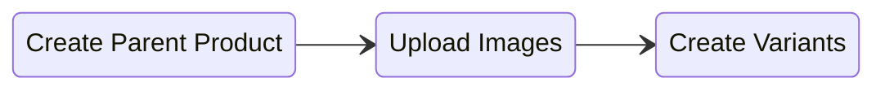
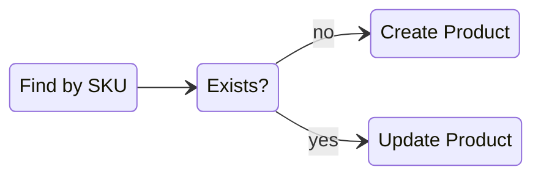

import { Callout } from 'fumadocs-ui/components/callout';

Catalogue management can be automated through the Admin API to sync products from a PIM, ERP or another storefront, reprice in bulk, feed inventory from a warehouse, or let an AI agent set up a catalogue for you.

Below are best practices and guides for common scenarios merchants and partners use to manage products on the Admin API. Requests need the `catalogue:write` scope, and reading products needs `catalogue:read`.

### Product Model

Every product is a parent with one or more variants. The product holds the title, description, images, categories and `variant_attributes`. Each variant holds the `sku`, `prices`, `stockrecords`, `track_stock`, `allow_backorders` and its own `image` chosen from the product's images.

A product without `variant_attributes` still has one variant, the default variant, and that is where its SKU, price and stock live. A product with `variant_attributes` such as Color and Size has one variant per combination.

In responses, `structure` is `parent` on the product and `child` on each entry in its `variants` array. The API never creates `standalone`, so it only appears on older existing products.

<Callout type="info" title="Prices and Stock Live on Variants">
Prices and stockrecords are always on the variant. Creating a price on a parent product is rejected with "This action is not allowed on parent products." Use the variant `id` from the `variants` array when calling the prices and stockrecords endpoints.
</Callout>

### Create a Simple Product

Create a product sold in one form with a single POST to the [productsCreate](/docs/admin-api/reference/products/productsCreate) endpoint. Send no `variant_attributes` and exactly one entry in `variants` carrying the SKU, price and stock for its default variant.

```json title="Create Simple Product" http-method="POST" http-target="https://{store}.29next.store/api/admin/products/"
{
  "title": "Classic Tee",
  "description": "<p>Heavyweight cotton tee.</p>",
  "is_public": true,
  "categories": [12], // category ids
  "variants": [
    {
      "sku": "TEE-CLASSIC",
      "upc": "0123456789012",
      "track_stock": true,
      "allow_backorders": false,
      "requires_shipping": true,
      "unit_cost": "5.00",
      "prices": [
        {
          "currency": "USD",
          "price": "24.99",
          "retail": "29.99" // optional compare-at price
        }
      ],
      "stockrecords": [
        {
          "location_id": 1, // fulfillment location id
          "num_in_stock": 100,
          "low_stock_threshold": 10
        }
      ]
    }
  ]
}
```

The response is the full product with `id`, `slug`, `url` and the default variant as the only entry in `variants`. Sending more than one entry in `variants` without `variant_attributes` is rejected with "Default product must be only one."

<Callout type="info" title="Variants Need Prices and Stockrecords">
Every variant you create must include `prices` and `stockrecords`. The only exception is a variant with `requires_shipping` set to `false`, which gets a stockrecord at your default location automatically.
</Callout>

### Create a Product with Variants

A product sold in several options is a parent with `variant_attributes` such as Color and Size, and one variant per combination. There are two ways to create it:

- **Single request** creates the parent and its variants in one call. Use it when the variants share the parent's images.
- **Step by step** creates the parent, uploads images, then creates each variant. Use it when each variant needs its own image, because a variant's `image` is an ID from the parent's image list and cannot be set inside the nested `variants` array.

#### Single Request

Send `variant_attributes` and `variants` together to the [productsCreate](/docs/admin-api/reference/products/productsCreate) endpoint. Each variant picks one value for every attribute in `variant_attribute_values`.

```json title="Create Product With Variants" http-method="POST" http-target="https://{store}.29next.store/api/admin/products/"
{
  "title": "Classic Tee",
  "description": "<p>Heavyweight cotton tee.</p>",
  "is_public": true,
  "categories": [12],
  "variant_attributes": [
    {
      "name": "Color",
      "values": ["Black", "White"]
    },
    {
      "name": "Size",
      "values": ["S", "M", "L"]
    }
  ],
  "variants": [
    {
      "sku": "TEE-CLASSIC-BLK-S",
      "variant_attribute_values": [
        { "name": "Color", "value": "Black" },
        { "name": "Size", "value": "S" }
      ],
      "prices": [
        { "currency": "USD", "price": "24.99", "retail": "29.99" }
      ],
      "stockrecords": [
        { "location_id": 1, "num_in_stock": 100, "low_stock_threshold": 10 }
      ]
    },
    {
      "sku": "TEE-CLASSIC-BLK-M",
      "variant_attribute_values": [
        { "name": "Color", "value": "Black" },
        { "name": "Size", "value": "M" }
      ],
      "prices": [
        { "currency": "USD", "price": "24.99", "retail": "29.99" }
      ],
      "stockrecords": [
        { "location_id": 1, "num_in_stock": 100, "low_stock_threshold": 10 }
      ]
    }
  ]
}
```

<Callout type="info" title="Values Must Match the Attribute">
Each `value` in `variant_attribute_values` must be one of the `values` listed on the matching attribute, and the combination of values must be unique across variants. A request that references an unknown attribute or value is rejected.
</Callout>

You do not have to create every combination up front. Add the rest later with the [Add a Variant](#add-a-variant) flow.

#### Step by Step

Creating a product with an image on each variant is a 3 step process:



1. Create the parent with its `variant_attributes` and no `variants` using the [productsCreate](/docs/admin-api/reference/products/productsCreate) endpoint.
2. Upload each image to the parent using the [productsImageCreate](/docs/admin-api/reference/products/productsImageCreate) endpoint and keep the returned image `id`.
3. Create each variant using the [productsVariantCreate](/docs/admin-api/reference/products/productsVariantCreate) endpoint with `image` set to one of those IDs.

#### Step 1: Create the Parent

```json title="Create Parent Product" http-method="POST" http-target="https://{store}.29next.store/api/admin/products/"
{
  "title": "Classic Tee",
  "description": "<p>Heavyweight cotton tee.</p>",
  "is_public": true,
  "categories": [12],
  "variant_attributes": [
    {
      "name": "Color",
      "values": ["Black", "White"]
    }
  ],
  "metadata": {
    "external_id": "prod_8813" // your system's product id
  }
}
```

#### Step 2: Upload the Images

```json title="Upload Product Image" http-method="POST" http-target="https://{store}.29next.store/api/admin/products/{id}/images/"
{
  "src": "https://cdn.example.com/classic-tee-black.png", // URL to fetch the image from
  "file_name": "classic-tee-black.png",
  "caption": "Classic Tee in Black",
  "display_order": 0 // 0 is the primary image
}
```

The response carries the image `id` you need in the next step.

#### Step 3: Create the Variants

```json title="Create Variant" http-method="POST" http-target="https://{store}.29next.store/api/admin/products/{id}/variants/"
{
  "sku": "TEE-CLASSIC-BLK",
  "upc": "0123456789012",
  "image": 501, // image id from the upload step
  "track_stock": true,
  "allow_backorders": false,
  "requires_shipping": true,
  "unit_cost": "5.00",
  "variant_attribute_values": [
    { "name": "Color", "value": "Black" }
  ],
  "prices": [
    { "currency": "USD", "price": "24.99", "retail": "29.99" }
  ],
  "stockrecords": [
    { "location_id": 1, "num_in_stock": 100, "low_stock_threshold": 10 }
  ],
  "metadata": {
    "external_id": "var_2201" // your system's variant id
  }
}
```

<Callout type="info" title="Variants Endpoint Returns Every Variant">
The response from [productsVariantCreate](/docs/admin-api/reference/products/productsVariantCreate) is the full list of the parent's variants, not only the one you created. Match yours by `sku` or `metadata` to read back its `id`.
</Callout>

### Add a Variant

Add a variant to an existing product with the [productsVariantCreate](/docs/admin-api/reference/products/productsVariantCreate) endpoint, using the same request as the step by step flow above. The attribute and value must already exist on the parent, so add a new value first with a PATCH to the [productsPartialUpdate](/docs/admin-api/reference/products/productsPartialUpdate) endpoint.

```json title="Add Attribute Value" http-method="PATCH" http-target="https://{store}.29next.store/api/admin/products/{id}/"
{
  "variant_attributes": [
    {
      "name": "Color",
      "values": ["Black", "White", "Navy"] // full list, including existing values
    }
  ]
}
```

<Callout type="warn" title="Variant Attributes Are Replaced, Not Merged">
`variant_attributes` on an update is the complete list. Any attribute you leave out is deleted from the product, and any value you leave out of `values` is deleted from that attribute. Always send every attribute and every value you want to keep.
</Callout>

### Product Images

Images belong to the product, not the variant. Upload one from a URL with `src`, or from base64 data with `attachment`, using the [productsImageCreate](/docs/admin-api/reference/products/productsImageCreate) endpoint. Send one or the other, not both.

```json title="Upload Image From Base64" http-method="POST" http-target="https://{store}.29next.store/api/admin/products/{id}/images/"
{
  "attachment": "iVBORw0KGgoAAAANSUhEUgAA...", // base64-encoded image
  "file_name": "classic-tee-white.png",
  "caption": "Classic Tee in White",
  "display_order": 1
}
```

<Callout type="info" title="Primary Image">
The image with `display_order` of `0` is the product's primary image. Change the order with a PATCH to the [productsImageUpdate](/docs/admin-api/reference/products/productsImageUpdate) endpoint.
</Callout>

#### Assign an Image to Variants

Set which variants show an image with `variants` on the [productsImageUpdate](/docs/admin-api/reference/products/productsImageUpdate) endpoint. A variant with no assigned image shows all of the parent's images.

```json title="Assign Image to Variants" http-method="PATCH" http-target="https://{store}.29next.store/api/admin/products/{id}/images/{imageId}/"
{
  "variants": [2231, 2232] // variant ids that use this image
}
```

The same link can be made from the variant side by setting `image` on the [productsVariantsPartialUpdate](/docs/admin-api/reference/products/productsVariantsPartialUpdate) endpoint.

#### Remove an Image

```json title="Remove Image" http-method="DELETE" http-target="https://{store}.29next.store/api/admin/products/{id}/images/{imageId}/"
{}
```

<Callout type="warn" title="Images Cannot Be Uploaded to a Variant">
Posting an image to a variant `id` is rejected with "The product cannot be a variant." Upload to the parent and assign it as shown above.
</Callout>

### Pricing

Each variant has one price per currency. Add a currency to a variant with the [productsPricesCreate](/docs/admin-api/reference/products/productsPricesCreate) endpoint, using the variant `id` in the path.

```json title="Add Currency Price" http-method="POST" http-target="https://{store}.29next.store/api/admin/products/{id}/prices/"
{
  "currency": "EUR",
  "price": "22.99",
  "retail": "27.99", // optional compare-at price
  "subscription": "19.99", // optional subscription price
  "subscription_suggested_downsell": "17.99" // optional downsell offer on cancel
}
```

Change an existing currency with a PATCH to the [productsPricesPartialUpdate](/docs/admin-api/reference/products/productsPricesPartialUpdate) endpoint.

```json title="Update Currency Price" http-method="PATCH" http-target="https://{store}.29next.store/api/admin/products/{id}/prices/{currency}/"
{
  "price": "21.99"
}
```

Remove a currency with the [productsPricesDestroy](/docs/admin-api/reference/products/productsPricesDestroy) endpoint.

<Callout type="info" title="Currency Must Be Enabled on the Store">
A price is rejected with "Currency is not available." when the store does not have that currency enabled, and with "This currency already exists." when the variant already has a price in it. Use PATCH to change an existing price.
</Callout>

### Inventory

Stock is tracked per variant per fulfillment location in a stockrecord. Find your location IDs with the [locationsList](/docs/admin-api/reference/fulfillment/locationsList) endpoint.

Two flags on the variant control how stock is applied. `track_stock` turns inventory tracking on, and `allow_backorders` keeps the variant purchasable when `num_in_stock` reaches zero.

#### Update Stock Level

Find the stockrecord `id` in the variant's `stockrecords` array, then PATCH the [stockrecordsPartialUpdate](/docs/admin-api/reference/products/stockrecordsPartialUpdate) endpoint.

```json title="Update Stock Level" http-method="PATCH" http-target="https://{store}.29next.store/api/admin/stockrecords/{id}/"
{
  "num_in_stock": 250,
  "low_stock_threshold": 20
}
```

#### Add a Location to a Variant

```json title="Create Stockrecord" http-method="POST" http-target="https://{store}.29next.store/api/admin/stockrecords/"
{
  "product": 2231, // variant id
  "location_id": 2,
  "num_in_stock": 40,
  "low_stock_threshold": 5
}
```

#### Remove a Location from a Variant

Delete the stockrecord with the [stockrecordsDestroy](/docs/admin-api/reference/products/stockrecordsDestroy) endpoint to stop fulfilling a variant from that location.

```json title="Delete Stockrecord" http-method="DELETE" http-target="https://{store}.29next.store/api/admin/stockrecords/{id}/"
{}
```

<Callout type="warn" title="Stockrecord Delete Rules">
A variant must keep at least one stockrecord, so the last one cannot be deleted. When `track_stock` is on, a stockrecord with `num_allocated` above zero cannot be deleted until those orders are fulfilled or cancelled. Both cases return a validation error and leave the stockrecord in place.
</Callout>

#### Find Low or Out of Stock Items

The [stockrecordsList](/docs/admin-api/reference/products/stockrecordsList) endpoint filters on `inventory_availability` with `in_stock`, `low_stock`, `out_of_stock` or `untracked`, and on `location_id`, `sku` and `search_text`.

```json title="Find Low Stock Items" http-method="GET" http-target="https://{store}.29next.store/api/admin/stockrecords/?inventory_availability=low_stock&location_id=1"
{}
```

Each stockrecord in the response carries `num_in_stock`, `num_allocated` for units reserved by open orders, and `net_stock_level` for what remains sellable.

### Subscription Products

Set `enable_subscription` on the product to allow it in subscription orders. When it is `true`, `interval` and `interval_counts` are required.

```json title="Enable Subscription" http-method="PATCH" http-target="https://{store}.29next.store/api/admin/products/{id}/"
{
  "enable_subscription": true,
  "interval": "month", // day, week, month or year
  "interval_counts": [1, 2, 3] // intervals the customer can choose from
}
```

Set the subscription price per currency on each variant with `subscription` in [Pricing](#pricing). See [API Subscription Management](/docs/admin-api/guides/subscription-management) for managing the subscriptions themselves.

### Organize the Catalogue

Create a category with the [categoriesCreate](/docs/admin-api/reference/products/categoriesCreate) endpoint. A `slug` with `/` creates the parent categories in the path, so `apparel/tees` creates Apparel and nests Tees under it.

```json title="Create Category" http-method="POST" http-target="https://{store}.29next.store/api/admin/categories/"
{
  "name": "Tees",
  "slug": "apparel/tees",
  "description": "<p>All tees.</p>",
  "is_public": true,
  "image": "https://cdn.example.com/tees.png" // optional, fetched from the URL
}
```

Assign categories, recommended products and ordering on the product.

```json title="Organize Product" http-method="PATCH" http-target="https://{store}.29next.store/api/admin/products/{id}/"
{
  "categories": [12, 15], // full list of category ids
  "recommended_products": [2100, 2104], // product ids, not variant ids
  "ranking": 10, // highest ranking shows first in listings
  "is_discountable": true // allow the product in offers
}
```

<Callout type="info" title="Recommended Products Cannot Be Variants">
`recommended_products` accepts product IDs only. Passing a variant `id` is rejected.
</Callout>

### Visibility and SEO

`is_public` controls whether the product shows in search results and catalogue listings. Set it to `false` for a product that should stay purchasable through a direct link, a campaign or an upsell without being discoverable.

```json title="Unlisted Product" http-method="PATCH" http-target="https://{store}.29next.store/api/admin/products/{id}/"
{
  "is_public": false,
  "meta_title": "Classic Tee | Example Store",
  "meta_description": "Heavyweight cotton tee in black and white.",
  "template": "tee", // optional, uses catalogue/product.tee.html from your theme
  "external_tax_code": "PC040100" // optional, for Avalara or TaxJar
}
```

### Sync From an External System

When another system owns the catalogue, key each product on its SKU and store the external ID in `metadata` so later runs can find it without a lookup table.



1. Look the SKU up with the [productsList](/docs/admin-api/reference/products/productsList) endpoint. The `sku` filter matches the product's own SKU and every variant SKU.
2. If nothing matches, create the product with the flows above.
3. If a product matches, find the variant with that `sku` in its `variants` array and PATCH only the fields that changed.

```json title="Find Product by SKU" http-method="GET" http-target="https://{store}.29next.store/api/admin/products/?sku=TEE-CLASSIC-BLK"
{}
```

```json title="Find Product by SKU Response"
{
  "results": [
    {
      "id": 1840,
      "structure": "parent",
      "title": "Classic Tee",
      "variants": [
        {
          "id": 2231,
          "sku": "TEE-CLASSIC-BLK", // matched variant
          "metadata": {
            "external_id": "var_2201"
          }
        }
      ]
    }
  ]
}
```

```json title="Update Variant" http-method="PATCH" http-target="https://{store}.29next.store/api/admin/products/variants/{id}/"
{
  "sku": "TEE-CLASSIC-BLK",
  "upc": "0123456789012",
  "unit_cost": "5.50",
  "prices": [
    { "currency": "USD", "price": "26.99", "retail": "29.99" }
  ],
  "metadata": {
    "external_id": "var_2201"
  }
}
```

<Callout type="info" title="Stock Is Updated Separately">
`stockrecords` is read only on variant updates. Push stock changes to the [stockrecordsPartialUpdate](/docs/admin-api/reference/products/stockrecordsPartialUpdate) endpoint as shown in [Inventory](#inventory).
</Callout>

Metadata keys must be defined first with the [metadataCreate](/docs/admin-api/reference/metadata/metadataCreate) endpoint, with `object` set to `product` or `variant`. To react to changes made in the dashboard, subscribe to product [webhooks](/docs/webhooks).

### Retire a Product

To stop selling a product without losing its order history, set `is_public` to `false` and remove it from the campaigns and offers that reference it. A variant that has been purchased should be kept for the same reason. Remove its variant attribute values instead of deleting it so it no longer appears as a selectable option.

```json title="Retire Product" http-method="PATCH" http-target="https://{store}.29next.store/api/admin/products/{id}/"
{
  "is_public": false
}
```
